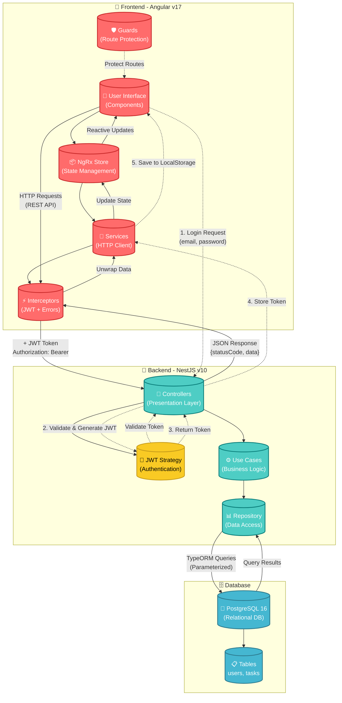
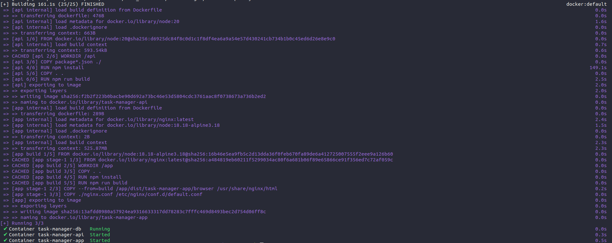

# 📋 Task Manager

> **A modern, full-stack task management application built with Angular and NestJS**

[](https://angular.io/)
[](https://nestjs.com/)
[](https://www.typescriptlang.org/)
[](https://www.docker.com/)
[](https://www.postgresql.org/)

## 🌟 Overview

Task Manager is a comprehensive enterprise-grade application demonstrating modern web development practices, clean architecture, and advanced Angular patterns. Built as a showcase for senior-level technical interviews, it implements industry-standard patterns including NgRx state management, reactive forms, JWT authentication, and performance optimization techniques.

### ✨ Key Features

- **🎯 Kanban Board**: Drag-and-drop task management with multiple status columns
- **🔐 Secure Authentication**: JWT-based authentication with refresh tokens
- **📝 Advanced Forms**: Dynamic reactive forms with custom validators and async validation
- **📊 State Management**: NgRx for predictable state management
- **🎨 Modern UI**: TailwindCSS with responsive design
- **🔍 Real-time Validation**: Server-side validation with debouncing
- **🚀 Performance Optimized**: Lazy loading, OnPush change detection ready
- **📱 Responsive Design**: Mobile-first approach with adaptive layouts
- **🛡️ Security First**: XSS/CSRF protection, secure HTTP-only cookies ready
- **📚 API Documentation**: Interactive Swagger documentation

---

## 🏗️ Architecture

### System Architecture Diagram



### Frontend (Angular v17)

```
task-manager-app/
├── core/           # Singleton services, guards, interceptors
├── shared/         # Reusable components, pipes, utilities
└── pages/          # Feature modules
    ├── auth/       # Authentication (Sign In/Sign Up)
    └── tasks/      # Task management with NgRx store
```

**Patterns Implemented:**

- Clean Architecture (Core/Shared/Feature)
- NgRx State Management (Actions/Reducers/Effects/Selectors)
- FormHelper Pattern for dynamic forms
- Custom & Async Validators
- HTTP Interceptors for auth and error handling
- Route Guards for authorization

### Backend (NestJS v10)

```
task-manager-api/
├── core/           # Business logic (entities, DTOs, use cases)
├── infra/          # Infrastructure (database, TypeORM)
└── presentation/   # Controllers, services, strategies
```

**Patterns Implemented:**

- Clean Architecture (Presentation/Application/Domain/Infrastructure)
- Repository Pattern with TypeORM
- Use Cases for business logic
- JWT Strategy with Passport
- Custom Decorators
- Exception Filters

---

## 🚀 Quick Start

### Prerequisites

- **[Node.js](https://nodejs.org/)** v20.0.0 or higher
- **[Docker Desktop](https://www.docker.com/products/docker-desktop/)** v26.1.1 or higher
- **[Git](https://git-scm.com/)**

### 🐳 Docker Setup (Recommended)

The easiest way to run the entire stack:

```bash
# Clone the repository
git clone <repository-url>
cd task-manager

# Start all services (API + App + PostgreSQL)
docker compose up --build -d
```

**What this does:**

- ✅ Installs all dependencies
- ✅ Builds both API and App
- ✅ Creates PostgreSQL database
- ✅ Starts API at `http://localhost:3333/api/`
- ✅ Starts App at `http://localhost:8080/`

**Success Indicator:**



### 🌐 Access the Application

| Service         | URL                                                      | Description           |
| --------------- | -------------------------------------------------------- | --------------------- |
| **Frontend**    | [http://localhost:8080](http://localhost:8080)           | Angular application   |
| **Backend API** | [http://localhost:3333/api](http://localhost:3333/api)   | NestJS REST API       |
| **API Docs**    | [http://localhost:3333/docs](http://localhost:3333/docs) | Swagger documentation |

> 💡 **Tip**: Use Chrome Incognito mode (Ctrl + Shift + N) for a clean testing session

### 🛑 Stop Services

```bash
# Stop all services
docker compose down

# Stop and remove volumes (clean slate)
docker compose down -v
```

---

## 💻 Development Setup

For detailed development instructions, see individual READMEs:

- **[Frontend Setup](./task-manager-app/README.md)** - Angular development server
- **[Backend Setup](./task-manager-api/README.md)** - NestJS API development

### Running Locally Without Docker

**Terminal 1 - API:**

```bash
cd task-manager-api
pnpm install
pnpm run start:dev
```

**Terminal 2 - App:**

```bash
cd task-manager-app
npm install
npm start
```

**Terminal 3 - Database:**

```bash
# You'll need PostgreSQL running locally
# Or use Docker for just the database:
docker run -d \
  --name task-manager-postgres \
  -e POSTGRES_USER=postgres \
  -e POSTGRES_PASSWORD=postgres \
  -e POSTGRES_DB=task_manager \
  -p 5432:5432 \
  postgres:16-alpine
```

---

## 🧪 Testing

### Frontend Tests

```bash
cd task-manager-app
npm run test              # Run Jest tests
npm run test:coverage     # Generate coverage report
```

### Backend Tests

```bash
cd task-manager-api
pnpm run test             # Run unit tests
pnpm run test:cov         # Generate coverage report
```

---

## 📚 Documentation

### Angular Study Guides

Comprehensive interview preparation guides demonstrating advanced Angular concepts:

- **[Master Index](./docs/README.md)** - Study plan and overview
- **[Core Concepts](./docs/ANGULAR-CORE-CONCEPTS.md)** - RxJS, NgRx, Change Detection
- **[Architecture](./docs/ANGULAR-ARCHITECTURE.md)** - Clean Architecture, DI, Lazy Loading
- **[Forms & Security](./docs/ANGULAR-FORMS-SECURITY.md)** - Reactive Forms, Validators, JWT
- **[Performance](./docs/ANGULAR-PERFORMANCE.md)** - OnPush, TrackBy, Bundle Optimization
- **[Quick Reference](./docs/ANGULAR-QUICK-REFERENCE.md)** - Cheat sheet for interviews

---

## 🛠️ Tech Stack

### Frontend

| Technology           | Version | Purpose               |
| -------------------- | ------- | --------------------- |
| **Angular**          | v17     | Frontend framework    |
| **TypeScript**       | v5.0    | Type-safe development |
| **NgRx**             | v17     | State management      |
| **RxJS**             | v7.8    | Reactive programming  |
| **TailwindCSS**      | v3      | Utility-first CSS     |
| **Angular Material** | v17     | UI components         |
| **Jest**             | v29     | Testing framework     |

### Backend

| Technology       | Version | Purpose               |
| ---------------- | ------- | --------------------- |
| **NestJS**       | v10     | Backend framework     |
| **TypeScript**   | v5.0    | Type-safe development |
| **TypeORM**      | v0.3    | ORM for PostgreSQL    |
| **PostgreSQL**   | v16     | Database              |
| **Passport JWT** | v10     | Authentication        |
| **Fastify**      | v4      | High-performance HTTP |
| **Swagger**      | v7      | API documentation     |
| **Jest**         | v29     | Testing framework     |

### DevOps

- **Docker** & **Docker Compose** - Containerization
- **Nginx** - Reverse proxy for frontend
- **ESLint** & **Prettier** - Code quality

---

## 📋 Project Structure

```
task-manager/
├── docs/                      # Documentation & study guides
│   ├── README.md             # Master index
│   ├── ANGULAR-*.md          # Angular interview guides
│   └── img/                  # Documentation images
│
├── task-manager-app/          # Angular frontend
│   ├── src/
│   │   ├── app/
│   │   │   ├── core/         # Singletons (guards, interceptors)
│   │   │   ├── shared/       # Reusable components
│   │   │   └── pages/        # Feature modules
│   │   └── assets/           # Static assets
│   ├── Dockerfile
│   └── nginx.conf
│
├── task-manager-api/          # NestJS backend
│   ├── src/
│   │   ├── core/             # Business logic
│   │   ├── infra/            # Infrastructure
│   │   ├── presentation/     # Controllers
│   │   └── shared/           # Utilities
│   └── Dockerfile
│
├── docker-compose.yml         # Docker orchestration
├── api.http                   # API test requests
└── README.md                  # This file
```

---

## 🎯 Features Showcase

### Authentication

- JWT-based authentication with access tokens
- Secure password hashing with bcrypt
- Protected routes with guards
- Automatic token injection via interceptors
- User-scoped data access

### Task Management

- Create, read, update, delete tasks
- Kanban board with status columns (Open, In Progress, Done)
- Task properties: code, title, description, priority, category, assignee, hours, deadline
- Real-time task code validation (async validator)
- User-specific task lists

### Forms & Validation

- Dynamic reactive forms with FormHelper pattern
- Custom synchronous validators (format, date validation)
- Custom asynchronous validators (uniqueness checks)
- Conditional validation based on field values
- Real-time error messages

### State Management

- Centralized state with NgRx store
- Optimistic updates with rollback on error
- Loading and error states
- Memoized selectors for performance

---

## 🔒 Security Features

- ✅ XSS Protection (Angular's built-in sanitization)
- ✅ CSRF Protection (XSRF-TOKEN headers)
- ✅ JWT Authentication with secure token storage
- ✅ Password hashing (bcrypt)
- ✅ SQL Injection prevention (TypeORM parameterized queries)
- ✅ HTTP-only cookie ready
- ✅ CORS configuration
- ✅ Input validation (DTO validation with class-validator)

---

## 🚀 Performance Optimizations

- ✅ Lazy loading for feature modules
- ✅ OnPush change detection ready
- ✅ TrackBy functions for lists
- ✅ NgRx memoized selectors
- ✅ Debounced search/validation
- ✅ AOT compilation
- ✅ Tree-shaking with providedIn: 'root'
- ✅ Bundle size optimization
- ✅ Async pipe for automatic subscription management

---

## 🤝 Contributing

This is a portfolio/interview preparation project, but feedback and suggestions are welcome!

1. Fork the repository
2. Create a feature branch (`git checkout -b feature/amazing-feature`)
3. Commit your changes (`git commit -m 'Add amazing feature'`)
4. Push to the branch (`git push origin feature/amazing-feature`)
5. Open a Pull Request

---

## 📝 API Endpoints

### Authentication

```
POST   /auth/signup          Create new user
POST   /auth/signin          Sign in user
```

### Tasks

```
GET    /tasks                List user's tasks
POST   /tasks                Create new task
GET    /tasks/:id            Get task by ID
PATCH  /tasks/:id            Update task
DELETE /tasks/:id            Delete task
GET    /tasks/check-code/:code  Check task code availability
```

**📖 Full API documentation available at:** `http://localhost:3333/docs`

---

## 🐛 Troubleshooting

### Docker Issues

**Port already in use:**

```bash
# Check what's using the port
sudo lsof -i :8080  # or :3333, :5432

# Stop the process or change port in docker-compose.yml
```

**Docker build fails:**

```bash
# Clean Docker cache and rebuild
docker system prune -a
docker compose up --build
```

### Database Issues

**Connection refused:**

```bash
# Ensure PostgreSQL container is running
docker ps

# Check database logs
docker logs task-manager-db
```

**Reset database:**

```bash
# Stop and remove volumes
docker compose down -v

# Restart
docker compose up --build
```
